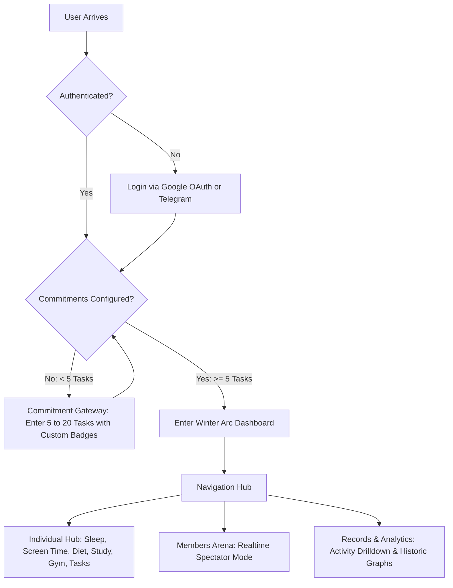

<div align="center">

# ❄️ EXCLUSIVE WINTER ARC CHALLENGE

### *The Ultimate Self-Mastery, Habit Execution & Public Accountability Platform*

[](https://nextjs.org/)
[](https://www.typescriptlang.org/)
[](https://tailwindcss.com/)
[](https://supabase.com/)
[](https://ai.google.dev/)
[](https://developers.google.com/fit)

<p align="center">
  <b>Uncompromising discipline. Real-time community accountability. Zero excuses.</b><br>
  Built for athletes, competitive scholars, and relentless builders entering their Winter Arc.
</p>

[Features](#-key-features) • [Architecture](#-system-architecture) • [Database Schema](#-database-schema) • [Quickstart](#-getting-started) • [API Integrations](#-api--hardware-integrations) • [Environment Setup](#-environment-variables)

</div>

---

## 📌 Project Overview

The **Exclusive Winter Arc Challenge** is an aesthetic, high-performance web platform designed to enforce peak mental, physical, and academic discipline over the Winter Arc period (typically 90 days from October to January).

Unlike conventional habit trackers that offer passive reminders and private excuses, this platform treats personal growth as an open-arena sport:
1. **Public Accountability & Spectator Mode:** Every participant's progress, commitments, and daily logs are visible in real-time to other members with **sub-3-second synchronization**.
2. **Strict Gatekeeping:** Users must commit to between **5 and 20 non-negotiable rules/tasks** before gaining access to the challenge dashboard.
3. **Hard Midnight Cutoffs (12:00 AM):** Unfinished daily tasks and unlogged metrics lock at midnight—preserving historical truth and eliminating procrastination.
4. **AI-Powered Nutrition Analysis:** Powered by **Google Gemini Flash**, users type their meals naturally (e.g., *"3 boiled eggs, 2 slices whole wheat toast, and black coffee"*) and receive instantaneous calorie and macronutrient surplus/deficit metrics.
5. **Hardware & Sensor Sync:** Integrates with the **Web Bluetooth API** and **Google Fit REST API** for automatic step counts, smartwatch heart rate capture (min/avg/max), and sleep tracking.

---

## 🎯 Core User Journey



---

## ✨ Key Features

### 1. 🔐 Multi-Provider Authentication
- **Google OAuth 2.0:** Secure single-click sign-in handled through Supabase Auth.
- **Telegram Login Widget:** High-speed authentication for community-first members via Telegram Bot API.

### 2. 🛡️ The Commitment Gateway
- New users must define their foundational commitments upon first login.
- Minimum **5 commitments**, maximum **20 commitments**.
- Each commitment receives a distinctive identifying bullet/badge.
- The challenge dashboard unlocks **only after** meeting the threshold.
- Automatic day tracking (e.g., `Day 1`, `Day 14`, `Day 90`) with smart morning check-in detection if accessed before 12:00 PM.

---

### 3. 👤 Pillar I: Individual Dashboard (Hamburger Drawer Navigation)

#### 🛌 A. Wakeup & Sleep Time Management
- **Interactive Sleep Clock:** Tap `Sleep` to trigger a live timer accompanied by a motivational *"Goodnight"* interface.
- **Wakeup Lock:** Tapping `Wake Up` logs sleep duration and calculates circadian efficiency.
- **Discipline Grace Period:** Allows one-time manual adjustments (e.g., if woke up at 06:10 instead of 06:00), after which the record permanently locks.
- **Smartwatch Bluetooth Sync:** Connects via Web Bluetooth API to read sleep stages and sleep duration directly from paired wearables.

#### 📱 B. Daily Screen Time Record
- **Manual Input with Proof:** Enter hours and minutes with screenshot proof uploads stored in Supabase Storage.
- **Device Usage API Integration:** Direct reading of screen-time metrics via native device integrations and Web APIs where supported.

#### 🥗 C. AI Health & Diet Engine (Google Gemini Flash)
- **4 Meal Segments:** `Breakfast`, `Lunch`, `Snacks`, `Dinner`.
- **Instant Natural Language Analysis:** Converts unstructured text into precise nutritional breakdowns:
  - Calories consumed per meal
  - Cumulative daily calorie intake
  - Calorie surplus or deficit relative to the user's Basal Metabolic Rate (BMR) / TDEE target
- Real-time response speed (< 1 second) using Google Gemini Flash.

#### 📚 D. The Study Chamber
- **Stream Categorization:**
  - `Science`
  - `Commerce`
  - `Arts`
  - Specialized tracks: `JEE (Main + Advanced)`, `NEET`, and custom exam preparations.
- **Dynamic Subject Management:** Add, customize, rename, or delete subjects tailored to individual curricula.
- **Dual-Timer System:**
  - **Subject Timer:** Independent timer dedicated to the currently active subject session.
  - **Global Top-Bar Timer:** Automatically aggregates cumulative study hours across all subjects during the day.
- **Focus Features:** Built-in Pomodoro cycles (25/5 or 50/10) with focus alarms and task lists per subject.

#### 🏋️ E. Gym & Home Workout Arena
- **Mode Toggle:** Switch between `Gym Workout` and `Home Calisthenics`.
- **Live Biometrics:** Smartwatch heart-rate monitoring displaying **Min BPM**, **Max BPM**, and **Average BPM**.
- **Pedometer & Step Tracker:** Sticky top-bar step counter with automatic background sync via **Google Fit API** or manual entry.
- **Exhaustive Gym Exercise Catalog:**

| Muscle Group | Supported Exercises & Sub-Workouts |
| :--- | :--- |
| **Abs** | Ab-Wheel Rollout, Cable Crunch, Crunch, Crunch Machine, Decline Crunch, Dragon Flag, Hanging Knee Raise, Hanging Leg Raise, Plank, Side Plank |
| **Back** | Barbell Row, Barbell Shrug, Chin Up, Deadlift, Dumbbell Row, Good Morning, Hammer Strength Row, Lat Pulldown, Machine Shrug, Neutral Chin Up, Pendlay Row, Pull Up, Rack Pull, Seated Cable Row, Straight-Arm Cable Pushdown, T-Bar Row |
| **Biceps** | Barbell Curl, Cable Curl, Dumbbell Concentration Curl, Dumbbell Curl, Dumbbell Hammer Curl, Dumbbell Preacher Curl, EZ-Bar Curl, EZ-Bar Preacher Curl, Seated Incline Dumbbell Curl, Seated Machine Curl |
| **Cardio** | Cycling, Elliptical Trainer, Rowing Machine, Running (Outdoor), Running (Treadmill), Stationary Bike, Swimming, Walking |
| **Chest** | Cable Crossover, Decline Barbell Bench Press, Decline Hammer Strength Chest Press, Flat Barbell Bench Press, Flat Dumbbell Bench Press, Flat Dumbbell Fly, Incline Barbell Bench Press, Incline Dumbbell Bench Press, Incline Dumbbell Fly, Incline Hammer Strength Chest Press, Seated Machine Fly |
| **Legs** | Barbell Calf Raise, Barbell Front Squat, Barbell Glute Bridge, Barbell Squat, Donkey Calf Raise, Glute-Ham Raise, Leg Extension Machine, Leg Press, Lying Leg Curl Machine, Romanian Deadlift, Seated Calf Raise Machine, Seated Leg Curl Machine, Standing Calf Raise Machine, Stiff-Legged Deadlift, Sumo Deadlift |
| **Shoulders** | Arnold Dumbbell Press, Behind The Neck Barbell Press, Cable Face Pull, Front Dumbbell Raise, Hammer Strength Shoulder Press, Lateral Dumbbell Raise, Lateral Machine Raise, Log Press, One-Arm Standing Dumbbell Press, Overhead Press, Push Press, Rear Delt Dumbbell Raise, Rear Delt Machine Fly, Seated Dumbbell Lateral Raise, Seated Dumbbell Press, Smith Machine Overhead Press |
| **Triceps** | Cable Overhead Triceps Extension, Close Grip Barbell Bench Press, Dumbbell Overhead Triceps Extension, EZ-Bar Skullcrusher, Lying Triceps Extension, Parallel Bar Triceps Dip, Ring Dip, Rope Push Down, Smith Machine Close Grip Bench Press, V-Bar Push Down |
| **Home Workout**| Calisthenics, Push-ups, Bodyweight Squats, Burpees, Lunges, Dips, Pike Push-ups, Doorframe Pull-ups, Resistance Bands |

- **Workout Logging:** Log sets and reps (e.g. `4 sets x 10 reps @ 80kg`); dynamic metabolic equivalent (MET) algorithms estimate precise calories burned per exercise.

#### ⏱️ F. Strict Daily Tasks Checklist
- Add daily objectives linked to your primary commitments.
- **The 12:00 AM Midnight Lock:** Any task not checked off before midnight is permanently locked as `Incomplete`. No retroactive editing is permitted.

---

### 4. 👥 Pillar II: Members Arena (Spectator Mode)
- Real-time directory of all active Winter Arc participants.
- **Spectator Mode:** Click on any member to inspect their profile:
  - View their initial 5–20 commitments
  - Inspect their daily task completion rate
  - View their current workout volume, study hours, and diet logs
  - **Read-Only Security:** Zero editing or tampering permissions for spectators.

---

### 5. 📊 Pillar III: Records & Deep Analytics
- Dedicated historical section partitioned to prevent data pollution between disciplines.
- **Interactive Drilldown:** Click any activity (e.g., *Deadlift*, *Physics Studies*, *Screen Time*, *Caloric Deficit*) to reveal:
  - Chronological activity ledger
  - Interactive charts & trendlines across custom date ranges
  - Personal records (PRs), volume progression, and consistency streaks

---

## 🏗️ System Architecture

```
┌─────────────────────────────────────────────────────────────────────────┐
│                           CLIENT BROWSER                                │
│  ┌───────────────────────────────────────────────────────────────────┐  │
│  │   Next.js 14 App Router + Tailwind CSS + Framer Motion            │  │
│  │   - Individual Dashboard (Drawer)                                 │  │
│  │   - Members Spectator Mode                                        │  │
│  │   - Records & Visual Analytics (Recharts)                         │  │
│  └──────────────────┬─────────────────────────────┬──────────────────┘  │
│                     │                             │                     │
│          Web Bluetooth API              Supabase Client SDK             │
│        (Smartwatch HR & Sleep)          (Sub-3s Realtime Sync)          │
└─────────────────────┼─────────────────────────────┼─────────────────────┘
                      │                             │
                      ▼                             ▼
┌───────────────────────────┐         ┌───────────────────────────────────┐
│     EXTERNAL DEVICES      │         │             SUPABASE              │
│  - Bluetooth Smartwatch   │         │  - PostgreSQL + Row-Level Security│
│  - Fitness Wearables      │         │  - Supabase Realtime Channels     │
└───────────────────────────┘         │  - Supabase Auth (Google/OAuth)   │
                                      │  - Supabase Storage (Proof Upload)│
                                      └─────────────────┬─────────────────┘
                                                        │
                      ┌─────────────────────────────────┴─────────────────┐
                      │                                                   │
                      ▼                                                   ▼
┌───────────────────────────┐                           ┌───────────────────────────────────┐
│     GOOGLE GEMINI AI      │                           │      EXTERNAL API SERVICES        │
│  - Gemini 2.5 Flash       │                           │  - Google Fit API (Step Sync)     │
│  - Sub-1s Nutrition Parse │                           │  - Telegram Login Bot API         │
└───────────────────────────┘                           └───────────────────────────────────┘
```

---

## 🗄️ Database Schema

The platform relies on Supabase (PostgreSQL) with strict **Row Level Security (RLS)** ensuring users can write only to their own rows, while allowing public read access for **Members Spectator Mode**.

```sql
-- 1. PROFILES & USER STATS
CREATE TABLE profiles (
  id UUID REFERENCES auth.users(id) PRIMARY KEY,
  full_name TEXT NOT NULL,
  username TEXT UNIQUE NOT NULL,
  avatar_url TEXT,
  provider TEXT CHECK (provider IN ('google', 'telegram')),
  challenge_day INT DEFAULT 1,
  has_onboarded BOOLEAN DEFAULT FALSE,
  created_at TIMESTAMPTZ DEFAULT NOW(),
  updated_at TIMESTAMPTZ DEFAULT NOW()
);

-- 2. COMMITMENT GATEWAY (5 to 20 commitments per user)
CREATE TABLE commitments (
  id UUID DEFAULT gen_random_uuid() PRIMARY KEY,
  user_id UUID REFERENCES profiles(id) ON DELETE CASCADE,
  title TEXT NOT NULL,
  bullet_icon TEXT NOT NULL, -- Distinct bullet/icon identifier
  created_at TIMESTAMPTZ DEFAULT NOW()
);

-- 3. SLEEP LOGS
CREATE TABLE sleep_records (
  id UUID DEFAULT gen_random_uuid() PRIMARY KEY,
  user_id UUID REFERENCES profiles(id) ON DELETE CASCADE,
  date DATE NOT NULL,
  sleep_time TIMESTAMPTZ,
  wake_time TIMESTAMPTZ,
  duration_minutes INT,
  is_locked BOOLEAN DEFAULT FALSE,
  source TEXT DEFAULT 'manual' CHECK (source IN ('manual', 'bluetooth')),
  created_at TIMESTAMPTZ DEFAULT NOW()
);

-- 4. SCREEN TIME RECORDS
CREATE TABLE screen_time_records (
  id UUID DEFAULT gen_random_uuid() PRIMARY KEY,
  user_id UUID REFERENCES profiles(id) ON DELETE CASCADE,
  date DATE NOT NULL,
  total_minutes INT NOT NULL,
  proof_image_url TEXT,
  source TEXT DEFAULT 'manual' CHECK (source IN ('manual', 'api')),
  created_at TIMESTAMPTZ DEFAULT NOW()
);

-- 5. NUTRITION & DIET LOGS (GEMINI AI)
CREATE TABLE diet_logs (
  id UUID DEFAULT gen_random_uuid() PRIMARY KEY,
  user_id UUID REFERENCES profiles(id) ON DELETE CASCADE,
  date DATE NOT NULL,
  meal_type TEXT CHECK (meal_type IN ('breakfast', 'lunch', 'snacks', 'dinner')),
  raw_input TEXT NOT NULL,
  parsed_items JSONB,
  calories INT NOT NULL,
  created_at TIMESTAMPTZ DEFAULT NOW()
);

-- 6. STUDY SESSIONS
CREATE TABLE study_sessions (
  id UUID DEFAULT gen_random_uuid() PRIMARY KEY,
  user_id UUID REFERENCES profiles(id) ON DELETE CASCADE,
  stream TEXT NOT NULL, -- Science, Commerce, Arts, JEE, NEET, etc.
  subject_name TEXT NOT NULL,
  duration_seconds INT NOT NULL,
  date DATE NOT NULL,
  notes TEXT,
  created_at TIMESTAMPTZ DEFAULT NOW()
);

-- 7. WORKOUT & GYM RECORDS
CREATE TABLE workout_logs (
  id UUID DEFAULT gen_random_uuid() PRIMARY KEY,
  user_id UUID REFERENCES profiles(id) ON DELETE CASCADE,
  workout_type TEXT CHECK (workout_type IN ('gym', 'home')),
  muscle_group TEXT NOT NULL, -- Abs, Back, Chest, Legs, etc.
  exercise_name TEXT NOT NULL,
  sets INT NOT NULL,
  reps INT NOT NULL,
  weight_kg NUMERIC(5,2),
  calories_burned INT,
  heart_rate_avg INT,
  date DATE NOT NULL,
  created_at TIMESTAMPTZ DEFAULT NOW()
);

-- 8. DAILY TASKS (WITH 12:00 AM LOCK)
CREATE TABLE daily_tasks (
  id UUID DEFAULT gen_random_uuid() PRIMARY KEY,
  user_id UUID REFERENCES profiles(id) ON DELETE CASCADE,
  date DATE NOT NULL,
  task_name TEXT NOT NULL,
  is_completed BOOLEAN DEFAULT FALSE,
  is_locked BOOLEAN DEFAULT FALSE,
  completed_at TIMESTAMPTZ,
  created_at TIMESTAMPTZ DEFAULT NOW()
);

-- 9. STEP TRACKER
CREATE TABLE step_logs (
  id UUID DEFAULT gen_random_uuid() PRIMARY KEY,
  user_id UUID REFERENCES profiles(id) ON DELETE CASCADE,
  date DATE NOT NULL,
  step_count INT NOT NULL,
  source TEXT DEFAULT 'manual' CHECK (source IN ('manual', 'google_fit')),
  created_at TIMESTAMPTZ DEFAULT NOW()
);
```

---

## 🚀 Getting Started

### Prerequisites
- [Node.js](https://nodejs.org/) `>= 18.18.0`
- [npm](https://www.npmjs.com/) or [pnpm](https://pnpm.io/)
- A free [Supabase](https://supabase.com/) project
- A free [Google AI Studio](https://aistudio.google.com/) API Key for Gemini Flash

### Installation Steps

1. **Clone the Repository:**
   ```bash
   git clone https://github.com/your-username/winter-arc.git
   cd "Winter Arc"
   ```

2. **Install Dependencies:**
   ```bash
   npm install
   # or
   pnpm install
   ```

3. **Configure Environment Variables:**
   Copy `.env.example` into your active `.env.local`:
   ```bash
   cp .env.example .env.local
   ```
   Fill in your Supabase credentials, Google OAuth keys, Gemini API key, and Telegram Bot details.

4. **Initialize Supabase Schema:**
   - Go to your **Supabase Dashboard** -> **SQL Editor**.
   - Paste and run the schema from the [Database Schema](#-database-schema) section.
   - Under **Authentication** -> **Providers**, enable **Google**.
   - Under **Storage**, create a public bucket named `screentime-proofs`.

5. **Start the Development Server:**
   ```bash
   npm run dev
   # or
   pnpm dev
   ```
   Open [http://localhost:3000](http://localhost:3000) in your browser.

---

## 🔑 Environment Variables

The project requires the following environment variables configured in `.env.local` (see [`.env.example`](file:///.env.example)):

| Variable Name | Required | Description |
| :--- | :---: | :--- |
| `NEXT_PUBLIC_APP_URL` | **Yes** | The canonical URL of the application (e.g., `http://localhost:3000`). |
| `NEXT_PUBLIC_SUPABASE_URL` | **Yes** | Your Supabase project URL (`https://<project-id>.supabase.co`). |
| `NEXT_PUBLIC_SUPABASE_ANON_KEY` | **Yes** | Public Supabase anon key with Row Level Security enforcement. |
| `SUPABASE_SERVICE_ROLE_KEY` | **Yes** | Supabase admin key for secure backend cron and server operations. |
| `GOOGLE_CLIENT_ID` | **Yes** | Google OAuth Client ID for login and identity verification. |
| `GOOGLE_CLIENT_SECRET` | **Yes** | Google OAuth Client Secret. |
| `TELEGRAM_BOT_TOKEN` | Optional | Telegram Bot token from `@BotFather` for Telegram Login Widget. |
| `NEXT_PUBLIC_TELEGRAM_BOT_USERNAME` | Optional | Username of your Telegram Bot. |
| `GEMINI_API_KEY` | **Yes** | Google AI Studio API key for real-time meal & calorie analysis. |
| `GEMINI_MODEL` | **Yes** | Model identifier (defaults to `gemini-2.5-flash`). |
| `GOOGLE_FIT_CLIENT_ID` | Optional | Google Cloud OAuth ID with Fitness API enabled for step sync. |
| `GOOGLE_FIT_CLIENT_SECRET` | Optional | Google Cloud OAuth Secret for Google Fit. |
| `NEXT_PUBLIC_WINTER_ARC_START_DATE` | **Yes** | Start date in `YYYY-MM-DD` format (e.g., `2026-10-01`). |
| `NEXT_PUBLIC_MIN_COMMITMENTS` | **Yes** | Minimum tasks required to enter challenge (Default: `5`). |
| `NEXT_PUBLIC_MAX_COMMITMENTS` | **Yes** | Maximum tasks permitted in the commitment gateway (Default: `20`). |

---

## 🔌 API & Hardware Integrations

### 1. Google Gemini Flash (Nutrition Engine)
The platform uses the Gemini Live / Flash API to provide instant nutritional calculations without manual database entry.
```typescript
import { GoogleGenAI } from '@google/genai';

const ai = new GoogleGenAI({ apiKey: process.env.GEMINI_API_KEY });

export async function parseMealNutrition(mealDescription: string) {
  const response = await ai.models.generateContent({
    model: process.env.GEMINI_MODEL || 'gemini-2.5-flash',
    contents: `Analyze this meal: "${mealDescription}". 
    Return valid JSON with: { "items": [{"name": string, "calories": number, "protein": number, "carbs": number, "fats": number}], "total_calories": number }`,
    config: { responseMimeType: 'application/json' }
  });
  return JSON.parse(response.text);
}
```

### 2. Web Bluetooth API (Smartwatch Sync)
Enables pairing directly with Bluetooth Low Energy (BLE) smartwatches and heart rate monitors:
```typescript
async function connectHeartRateMonitor() {
  const device = await navigator.bluetooth.requestDevice({
    filters: [{ services: ['heart_rate'] }]
  });
  const server = await device.gatt.connect();
  const service = await server.getPrimaryService('heart_rate');
  const characteristic = await service.getCharacteristic('heart_rate_measurement');
  
  await characteristic.startNotifications();
  characteristic.addEventListener('characteristicvaluechanged', (event) => {
    const value = event.target.value;
    const heartRate = value.getUint8(1);
    console.log(`Live Heart Rate: ${heartRate} BPM`);
  });
}
```

### 3. Google Fit REST API (Pedometer Auto-Sync)
Fetches daily aggregated step count using the Google Fitness REST endpoint (`https://www.googleapis.com/fitness/v1/users/me/dataset:aggregate`), keeping the top-bar step counter continuously synchronized.

---

## ⏱️ The Midnight Lock Rule (Discipline Enforcement)

To uphold the core philosophy of the Winter Arc, the application enforces automated daily locks:
1. **Tasks & Routines:** Every day at **00:00 (12:00 AM)** local time, all uncompleted tasks for the preceding date are tagged with `is_locked = TRUE`.
2. **Sleep Times:** Once entered and confirmed, sleep & wake times cannot be modified after the grace period.
3. **Audit Trails:** Edits, deletions, or retroactive completions are barred by PostgreSQL RLS constraints.

---

## 🤝 Contributing

Contributions to improve performance, enhance wearable compatibility, or expand exam syllabi are welcome:
1. Fork the Project
2. Create your Feature Branch (`git checkout -b feature/NewFeature`)
3. Commit your Changes (`git commit -m 'Add NewFeature'`)
4. Push to the Branch (`git push origin feature/NewFeature`)
5. Open a Pull Request

---

## 📄 License

Distributed under the MIT License. See `LICENSE` for more information.

---

<div align="center">
  <sub>Built with relentless discipline for the Winter Arc. Stay focused.</sub>
</div>
